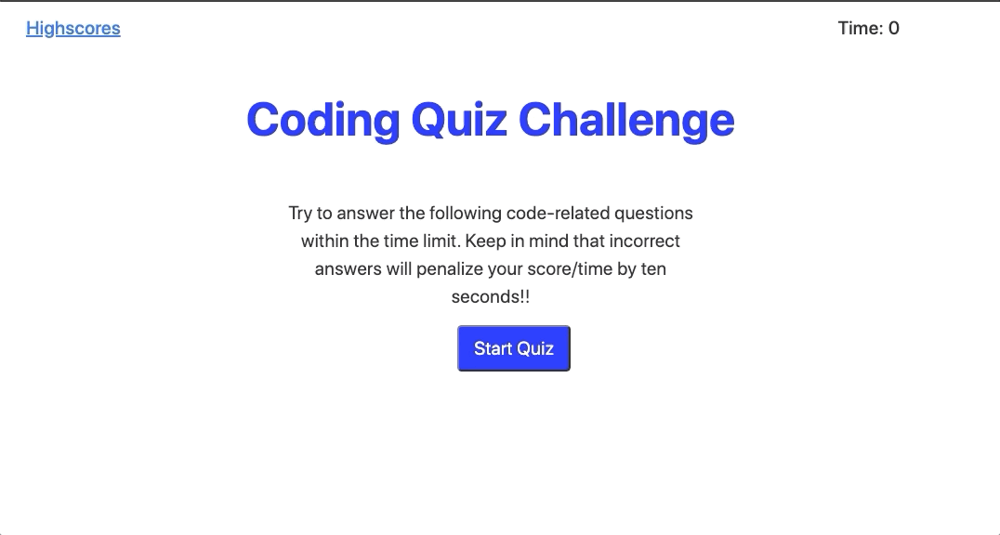

# Code_Quiz

## Description 

This is a Coding Quiz game. The game has a home screen that explains the rules and a start quiz button to begin. The quiz has five multiple choice questions, with a timer counting down. Each wrong answer deducts 15 seconds from the timer and the final score is the amount of time left.

The Coding quiz game runs in the browser and features dynamically updated HTML and CSS powered by JavaScript code. It is clean, polished and has a responsive user interface.

## Installation

Application Website URL: https://patelg1.github.io/Code_Quiz/

Repository URL: https://github.com/patelg1/Code_Quiz

## Usage 

